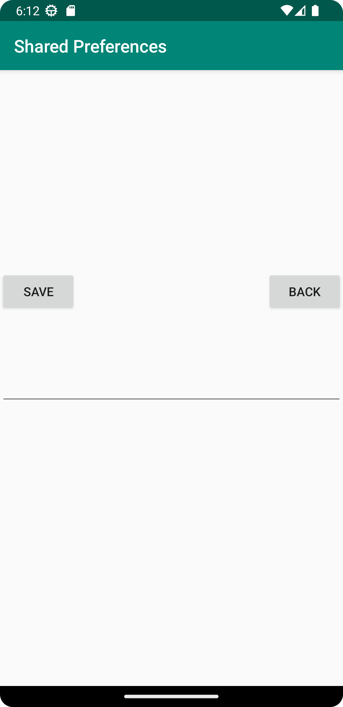
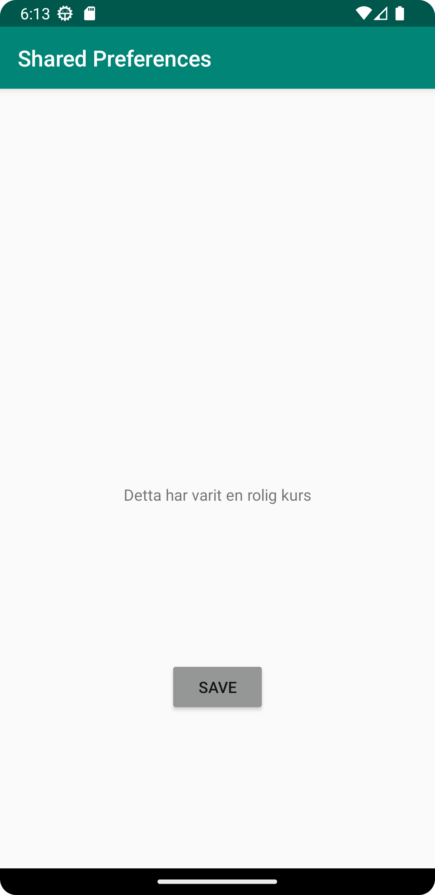

# Rapport

För att göra denna uppgiften så kunde stora delar från screens-uppgiften användas då det i princip var samma kod där en knapp får en 
ny intent som sedan tar oss till vår andra activity. Detta är samma som från förra uppgiften då vi sätter en onclicklistener på 
vår knapp som sedan startar en ny intent som tar oss till vår andra aktivitet.

            Buttonknapp.setOnClickListener(new View.OnClickListener() {
            @Override
            public void onClick(View v) {
                Intent Intent = new Intent(MainActivity.this, MainActivity2.class);
                startActivity(Intent);
            }
        });

Skillnaden är att vi i denna uppgift inte bara har en string och en int som ska skickas över utan istället så har vi en edittext
där vi kan skriva in en egen text som sedan sparas om man klickar på knappen save.

            Back = findViewById(R.id.Back);
        Back.setOnClickListener(new View.OnClickListener() {
            @Override
            public void onClick(View v) {
                finish();
            }
        });

För att få edittexten att fungera så måste vi göra stringen till edittext samt så gav jag den ett defaultvärde så att det finns en
placeholder text när man först startar appen.

        @Override
    protected void onResume() {
        super.onResume();
        String name = Preferences.getString("EditText", "inget namn hittades");
        TextView.setText(name);
    }

På andra sidan så har jag en edittext där man kan skriva in en egen text som man sedan kan spara med hjälp av save-knappen.



Denna text kommer sedan att visas på den första sidan om vi har gått in i edittext och sparat en egen "custom-text" då den 
variabeln skickas till vår andra acitivity.




## Följande grundsyn gäller dugga-svar:

- Ett kortfattat svar är att föredra. Svar som är längre än en sida text (skärmdumpar och programkod exkluderat) är onödigt långt.
- Svaret skall ha minst en snutt programkod.
- Svaret skall inkludera en kort övergripande förklarande text som redogör för vad respektive snutt programkod gör eller som svarar på annan teorifråga.
- Svaret skall ha minst en skärmdump. Skärmdumpar skall illustrera exekvering av relevant programkod. Eventuell text i skärmdumpar måste vara läsbar.
- I de fall detta efterfrågas, dela upp delar av ditt svar i för- och nackdelar. Dina för- respektive nackdelar skall vara i form av punktlistor med kortare stycken (3-4 meningar).

Programkod ska se ut som exemplet nedan. Koden måste vara korrekt indenterad då den blir lättare att läsa vilket gör det lättare att hitta syntaktiska fel.

```
function errorCallback(error) {
    switch(error.code) {
        case error.PERMISSION_DENIED:
            // Geolocation API stöds inte, gör något
            break;
        case error.POSITION_UNAVAILABLE:
            // Misslyckat positionsanrop, gör något
            break;
        case error.UNKNOWN_ERROR:
            // Okänt fel, gör något
            break;
    }
}
```

Bilder läggs i samma mapp som markdown-filen.


Läs gärna:

- Boulos, M.N.K., Warren, J., Gong, J. & Yue, P. (2010) Web GIS in practice VIII: HTML5 and the canvas element for interactive online mapping. International journal of health geographics 9, 14. Shin, Y. &
- Wunsche, B.C. (2013) A smartphone-based golf simulation exercise game for supporting arthritis patients. 2013 28th International Conference of Image and Vision Computing New Zealand (IVCNZ), IEEE, pp. 459–464.
- Wohlin, C., Runeson, P., Höst, M., Ohlsson, M.C., Regnell, B., Wesslén, A. (2012) Experimentation in Software Engineering, Berlin, Heidelberg: Springer Berlin Heidelberg.
